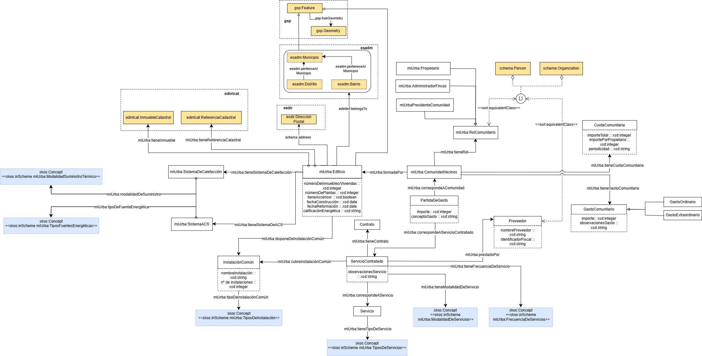

# Ontología miUrba

La ontología miUrba representa el dominio de las comunidades de vecinos, incluyendo información sobre los edificios, los inmuebles, las instalaciones, los servicios, los gastos y los agentes relacionados con su gestión.

# Propósito y alcance de la ontología

El propósito de la ontología miUrba es representar de forma estructurada la información relacionada con las comunidades de vecinos.

La ontología se organiza en varios ámbitos principales:

- **Comunidad y edificio**: información general sobre la comunidad de vecinos y el edificio.
- **Inmuebles**: representación de las viviendas, locales y otros inmuebles que forman parte del edificio.
- **Instalaciones y sistemas**: información sobre las instalaciones y sistemas comunes del edificio, como la calefacción o el agua caliente sanitaria.
- **Servicios**: representación de los servicios contratados por la comunidad.
- **Agentes y roles**: personas u organizaciones relacionadas con la comunidad y los roles que desempeñan.
- **Gastos**: información sobre los gastos comunitarios, incluidos los gastos ordinarios y extraordinarios.
- **Información catastral**: datos relacionados con la identificación y descripción catastral de los inmuebles.
- **Vocabularios controlados**: listas de conceptos definidas mediante SKOS para representar determinados valores de la ontología, como la modalidad de suministro térmico de los sistemas de calefacción y agua caliente sanitaria (ASC), los tipos de servicios, los distintos tipos de instalaciones, etc. 

# Prefijo y espacio de nombres de la ontología

El prefijo de la ontología es: **miUrba** y se encuentra publicada en el espacio de nombres: [https://w3id.org/miUrba#](https://w3id.org/miUrba#)

# Modelo conceptual de la ontología

# Estructura del repositorio

El repositorio debe contener (al menos) las siguientes carpetas

| Carpeta | Descripción |
|--------|--------------|
| **diagrams/** | Contiene diagramas y otros recursos que representan el modelo conceptual de la ontología (por ejemplo, jerarquías de clases, relaciones). |
| **documentation/** | Contiene la documentación de la ontología y artefactos relacionados en formato HTML o dirigida a usuarios. |
| **kos/** | Contiene la implementación de vocabularios controlados o KOS, generalmente implementaciones SKOS en RDF.|
| **ontology/** | Contiene los archivos de implementación de la ontología en formatos como .owl, .rdf, .ttl o .jsonld |
| **requirements/** | Contiene todos los documentos utilizados para definir los requisitos de la ontología en formato de preguntas de competencia con sus respectivas consultas de SPARQL|
| **shapes/** | Contiene las restricciones SHACL utilizad para validar datos respecto a la ontología.  |

# Mantenimiento del proyecto

Para gestionar esos incidentes o las mejoras sugeridas con respecto a la ontología, recomendamos seguir las guías proporcionadas en [Issues Management](https://github.com/nombre-repositorio/wiki/issues-management) para generar incidecias (trabajo en progreso).

# Financiación

Incluir aquí la información sobre financiación del proyecto e imágenes necesarias.
